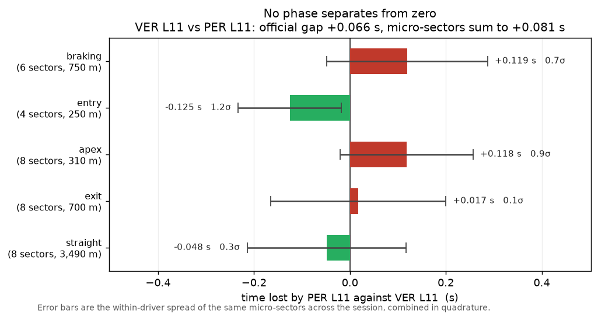
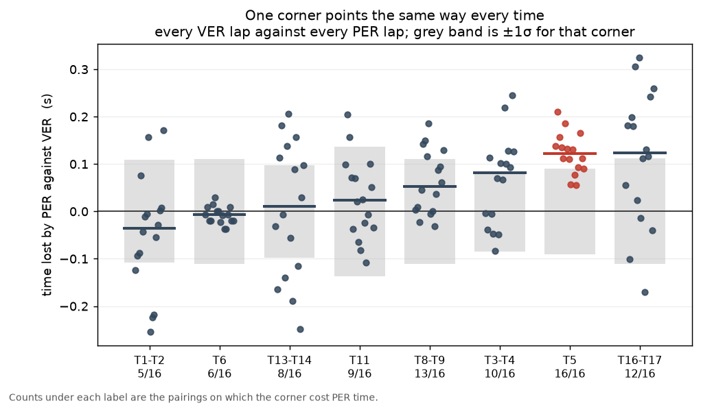
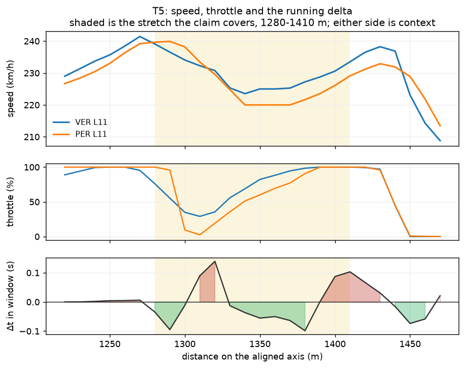
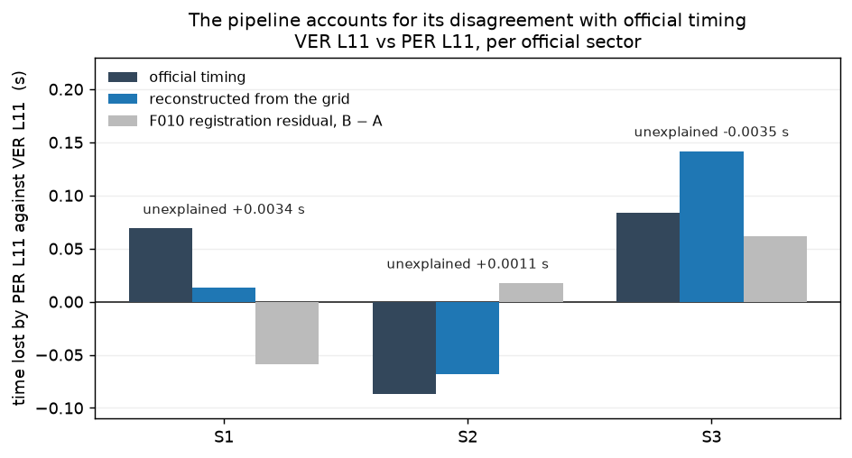

# Where did 0.066 seconds go? Suzuka 2024, Verstappen vs Pérez

**Finding, in one line:** it cannot be placed — but the same driver loses about
a tenth at the same corner on every lap you compare, and that can be.

Two Red Bulls, the same car, the same tyre, the same three minutes of a
qualifying session. Verstappen took pole with 1:28.197; Pérez was second with
1:28.263. Sixty-six thousandths of a second. This is a report on trying to say
where they went, using nothing but the telemetry Formula 1 publishes.

---

## The short version

1. **The pole gap does not decompose.** Cut the lap into 35 micro-sectors by
   corner phase — braking, entry, apex, exit, straight — and no phase and no
   corner separates from zero by more than 1.6 times its own lap-to-lap spread.
   With 4 Hz public telemetry, 0.066 s has no attribution. Anyone who shows you
   a bar chart placing it in a corner is showing you noise with a label on it.
2. **One corner does survive**, by repetition rather than by size: Pérez is
   slower through **T5** on **all sixteen** pairings of the two drivers' timed
   laps, median **+0.122 s**, and the raw speed channel agrees on every quick
   pairing.
3. **A 100 m braking-point difference turned out to be an artefact** of how a
   braking point is defined. 71 of the session's 74 laps dab the brake at the
   T8 kink before braking for Degner; a lap that skips the dab reads as braking
   100 m later.
4. **The reconstruction disagrees with official sector times by up to 0.058 s,
   and the pipeline already knows why** — to within 0.0035 s.

Every number here comes from
`data/processed/2024_Japan_Q_projection/findings/summary.json`, built from the
raw snapshot taken on **2026-09-01**. Nothing was typed in by hand.

---

## 1. The gap does not decompose



| phase | sectors | Δt, Pérez − Verstappen | 1σ | ratio |
|---|---|---|---|---|
| braking | 6 | +0.119 s | 0.168 s | 0.7 |
| entry | 4 | −0.125 s | 0.107 s | 1.2 |
| apex | 8 | +0.118 s | 0.138 s | 0.9 |
| exit | 8 | +0.017 s | 0.183 s | 0.1 |
| straight | 8 | −0.048 s | 0.166 s | 0.3 |
| **34 complete sectors** | | **+0.081 s** | | official gap +0.066 s |

The σ column is the within-driver spread of those same micro-sectors across the
whole session: how much a lap time in that stretch varies when the same driver
drives the same corner again. Every phase total is smaller than it. Corner by
corner it is no better — the largest, T5 at +0.138 s, is 1.5σ.

The two largest single-sector numbers say the rest. The T5 exit sector shows
+0.202 s and the 30 m straight immediately after it shows −0.119 s: adjacent,
opposite in sign, and together nearly zero. That is what happens when a car
samples at 4 Hz, roughly every 20 m at speed, and a boundary falls between two
samples — the time lands on one side or the other. It is not a driver doing
something at 1,395 m and undoing it at 1,415 m.

So the honest answer to the question in the title is: **this method cannot
place 0.066 s.** From the wider pairs in the same session — 0.29 s to Norris,
0.49 s to Sainz, 0.57 s to Hamilton — no single corner clears 2σ in any of
them either. Phase totals only get there when a gap is large *and*
concentrated, as Sainz's +0.473 s on the straights does at 2.9σ. As a rule of
thumb for this circuit and this source: **a corner-level claim needs about
0.2 s at that corner, and a phase-level claim about 0.3 s.**

---

## 2. What repetition finds that one lap cannot

A single lap-pair delta is one draw from a distribution about as wide as the
thing being measured. But both drivers set four timed laps, so there are
sixteen pairings — and asking which way each corner points, sixteen times, is a
question the noise cannot answer for you.



| corner | Pérez slower on | median | range | 1σ |
|---|---|---|---|---|
| **T5** | **16 / 16** | **+0.122 s** | +0.056 … +0.210 | 0.090 s |
| T16–T17 | 12 / 16 | +0.123 s | −0.170 … +0.325 | 0.112 s |
| T8–T9 | 13 / 16 | +0.053 s | −0.032 … +0.185 | 0.111 s |
| T3–T4 | 10 / 16 | +0.081 s | −0.083 … +0.245 | 0.084 s |
| T11 | 9 / 16 | +0.023 s | −0.109 … +0.205 | 0.136 s |
| T13–T14 | 8 / 16 | +0.011 s | −0.249 … +0.207 | 0.098 s |
| T6 | 6 / 16 | −0.007 s | −0.037 … +0.030 | 0.110 s |
| T1–T2 | 5 / 16 | −0.036 s | −0.255 … +0.171 | 0.109 s |

T5 is the only corner that never changes sign. Its median is no larger than
T16–T17's, and on its own it clears 2σ on just two of the sixteen pairings —
size is not what makes it a finding, consistency is.

Two checks before calling it one.

**The control.** Verstappen against his own other Q3 lap gives T5 at −0.025 s.
Whatever the sixteen pairings are seeing, the same driver in the same car does
not produce it.

**The traces.** Micro-sector times are built on boundaries; the speed channel is
not. Over exactly the stretch T5's micro-sectors cover — 1,280 m to 1,410 m,
chosen by the segmentation, not by us afterwards — Pérez is slower on average
on all four quick-lap pairings, by 2.2, 2.5, 4.2 and 4.5 km/h, and is the
slower car at 71%, 79%, 86% and 100% of the grid points in the window. He also
picks the throttle up later: 36% against 56% at 1,330 m, both at 100% by
1,390 m.



**T5 costs Pérez roughly a tenth against Verstappen, consistently, and it shows
in the speed as well as in the clock.** That is the one attributable difference
in this comparison — and note that it is nearly twice the gap between the two
laps, which is another way of saying the rest of the lap gives it back.

T16–T17 deserves a mention and not a claim: same median, but it changes sign
four times out of sixteen, and Verstappen's own two Q3 laps differ there by
0.125 s. It is a high-variance corner, not a demonstrated difference.

---

## 3. The braking point that moved 100 m without anyone braking differently

The corner metrics report Verstappen braking for T8–T9 at 2,220 m and Pérez at
2,320 m — a hundred metres, five times the ±20 m this pipeline claims as its
braking-point resolution. It would have been the headline of this document.

It is not real. Counting brake *applications* rather than reading the first
brake-on in the window:

| | applications | first | leading into the apex |
|---|---|---|---|
| Verstappen L11 | 2 | 2,220 m | 2,310 m |
| Pérez L11 | 1 | 2,320 m | 2,320 m |

Verstappen dabs the brake at the T8 kink, releases, and then brakes for Degner
at 2,310 m. Pérez does not dab; he brakes at 2,320 m. **Both brake for the
corner in the same place — 10 m apart, inside the window.** The metric was not
wrong about what it measured; it measured the wrong application.

This is the norm, not the exception: **71 of the session's 74 laps make the
dab.** The three that do not are Alonso L11, Pérez L11 and Verstappen L8.

With applications counted, the six braked corners read:

| corner | verdict | first applications | leading applications |
|---|---|---|---|
| T1–T2 | agree | 0 m | 0 m |
| T6 | agree | +10 m | +10 m |
| T11 | agree | 0 m | 0 m |
| T8–T9 | **metric artefact** | +100 m | +10 m |
| T16–T17 | **confirmed** | −40 m | −40 m |
| T13–T14 | **definition-sensitive** | +20 m | −30 m |

T16–T17 is a genuine difference and survives both readings: Pérez lifts and
brakes 40 m earlier into the chicane, visible in the throttle trace at 5,210 m
while Verstappen is still flat to 5,220 m. It is also the corner where Pérez
loses time on 12 of 16 pairings, which is at least a coherent story even if the
timing is not conclusive.

T13–T14 is the honest awkward case. Both laps brake twice into Spoon. Compare
first applications and Pérez brakes 20 m later; compare the ones that lead into
the apex and he brakes 30 m earlier. Neither reading is wrong. **The single
number is** — a braking point is not well defined at a corner with two
applications, and three of the six braked corners here have one on at least one
lap.

---

## 4. Checking the reconstruction against official timing

Everything above is built on times reconstructed from a 10 m distance grid.
Formula 1 publishes its own sector times, which come from timing loops. They
disagree — and a report that did not say by how much would not be worth much.



| | S1 | S2 | S3 |
|---|---|---|---|
| official sector gap, Pérez − Verstappen | +0.069 s | −0.087 s | +0.084 s |
| reconstructed from the grid | +0.013 s | −0.068 s | +0.142 s |
| difference | −0.056 s | +0.019 s | +0.058 s |
| F010 registration residual, Pérez − Verstappen | −0.059 s | +0.018 s | +0.061 s |
| **unexplained** | **+0.0034 s** | **+0.0011 s** | **−0.0035 s** |

The disagreement is real and it is up to 0.058 s — bigger than the gap being
measured. But it is not a mystery. Each lap crosses each timing line with its
own small offset between where the timing loop says the car was and where the
telemetry says it was, roughly 4 m, and the validation stage measures that per
lap. The difference between the two laps' offsets accounts for the whole
disagreement, leaving under 0.0035 s in every sector.

This is worth stating plainly because it cuts both ways: the pipeline is
internally consistent, *and* any single comparison between one of its times and
an official one carries about a tenth of a second at the 95th percentile. That
number is why section 1 says what it says.

---

## What this cannot tell you

- **One session, one circuit, one pair.** Whether T5 is something about Pérez
  or something about Pérez at Suzuka in Q3 2024 is not answerable from this
  data, and nothing here should be read as the former.
- **Sixteen pairings are not sixteen independent samples.** They come from
  eight laps. The claim is sign consistency across every pairing plus an
  independent speed-channel corroboration — deliberately not a p-value, which
  would assume an independence that is not there.
- **The 1σ figures are generous.** They are the within-driver spread, which
  contains real lap-to-lap driving variation as well as measurement noise. That
  is the right direction to err when the conclusions are mostly negative: a
  difference that cannot clear a generous bound will not clear a tight one.
- **Nothing here is about race pace.** Qualifying laps on new softs are the
  cleanest thing this data offers and also the least representative of a race.

---

## Reproducing it

The stack is containerised and the pipeline runs from the raw snapshot down.
With the session ingested and processed:

```python
from pathlib import Path
from src.report.session import build_findings

build_findings(
    Path("data/processed/2024_Japan_Q_projection"),
    Path("data/interim/grid/2024_Japan_Q_projection"),
    Path("data/interim/microsectors/2024_Japan_Q_projection"),
    ("VER", 11), ("PER", 11),
)
```

That writes `findings/summary.json` and the six frames beside it, and rerenders
the four figures in this document. It takes about two seconds. The acceptance
figures quoted here are asserted by `pytest -m data`.

**Source:** FastF1, snapshot `data/raw/fastf1/2026-09-01/2024_Japan_Q`, session
2024 Japanese Grand Prix Qualifying. Reference lap for the session-default
delta curves is VER L11; every comparison in this document subtracts the two
selected laps directly, so it does not depend on that choice.
